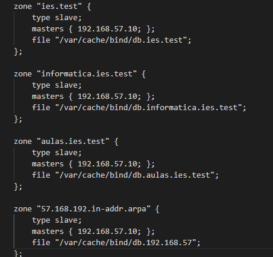

## 1. Se crea el vagrantfile

## 2. Creamos y configuramos los diferentes "provision.sh"
## Provision.sh

## Provision DNSA

## Provision DNSB

## 3. Se configuran los archivos de zona del DNSA
## db.192.168.57

## db.departamentos.ies.test

## db.aulas.ies.test

## db.informatica.ies.test

## db.ies.test

## named.conf.local

## 4. Se configuran los archivps de zona de DNSB
## named.conf.local

